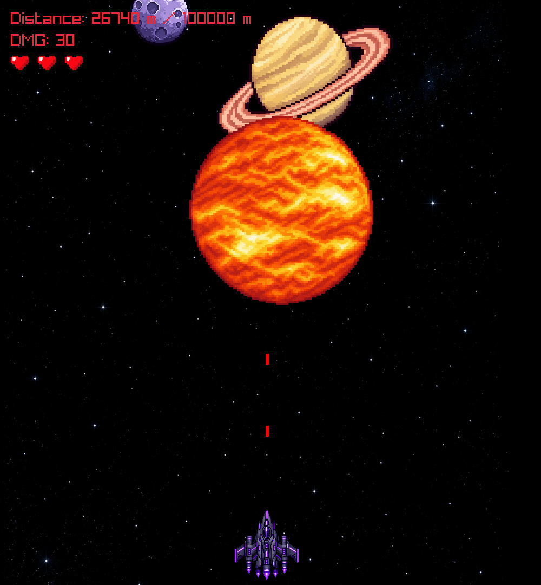

# 🚀 Galaxy Shooter

A 2D space shooter game built with **C++ and Raylib**.

The player controls a spaceship, destroys planets and meteors, increases bullet damage and tries to survive as long as possible.



## 🎮 Features

- 🚀 Spaceship movement
- ☄️ Different types of space objects
- 💥 Explosion animations
- 🔫 Shooting system
- 📈 Bullet damage progression
- 🌑 Black holes
- 🌍 Planets with different health values
- 🎵 Sound effects and background music
- 📏 Distance tracking
- 🎨 Pixel-art style

## 🛠 Technologies

- C++
- Raylib
- C++17
- Make
- Linux
- Git / GitHub

## 🎮 Controls

| Key | Action |
|---|---|
| `A` / `←` | Move left |
| `D` / `→` | Move right |
| Automatic | Shooting |

## 🚀 How to Run

### Requirements

- C++17 compiler
- Raylib
- Make

### Build

```bash
g++ -std=c++17 -O2 main.cpp -o main.exe -lraylib -lopengl32 -lgdi32 -lwinmm
./galaxy
```


```bash
make galaxy
./galaxy
```

